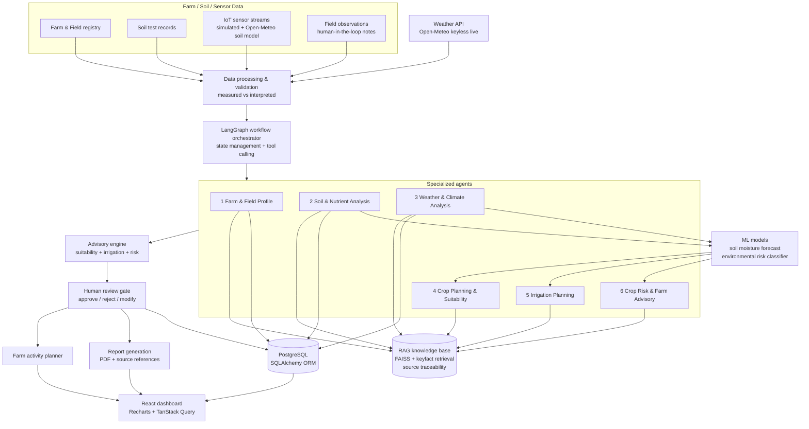

# Agentic AI Agricultural Crop Planning & Precision Farming System

A multi-agent decision-support system for smallholder farming. Six cooperating
agents read field measurements, soil tests, weather and agronomic knowledge, then
produce a crop plan, an irrigation recommendation, a risk advisory and a PDF report.

The system **advises**. It never actuates irrigation equipment, and every
consequential recommendation requires explicit human authorisation. See
[Safety contract](#safety-contract).

> **Not a medical or agronomic diagnosis tool.** The risk module reports whether
> the *environment* favours a disease or pest — it never claims a field is diseased.

---

## Table of contents

- [What it does](#what-it-does)
- [The 6 agents](#the-6-agents)
- [Architecture](#architecture)
- [Safety contract](#safety-contract)
- [Data honesty contract](#data-honesty-contract)
- [Quick start](#quick-start)
- [Configuration](#configuration)
- [Running the tests](#running-the-tests)
- [Acceptance test record (TC-01 … TC-06)](#acceptance-test-record-tc-01--tc-06)
- [API surface](#api-surface)
- [Project layout](#project-layout)
- [Tech stack](#tech-stack)
- [Deployment](#deployment)
- [Known limitations](#known-limitations)

---

## What it does

| Capability | Endpoint | Output |
|---|---|---|
| Crop suitability | `/api/v1/suitability` | Per-crop score with a factor breakdown and knowledge citations |
| Soil interpretation | `/api/v1/soil` | pH class, nutrient status, texture water-holding band |
| Weather | `/api/v1/weather` | Live provider data, or a fallback that is explicitly labelled |
| Sensor telemetry | `/api/v1/sensors` | Latest reading, 7-day trend, and a data-quality verdict |
| Irrigation | `/api/v1/irrigation` | Depth in mm, volume in m³, urgency, and a rationale |
| Environmental risk | `/api/v1/risk` | Severity bucket + the specific factors driving it |
| Activity plan | `/api/v1/activities` | Ordered, dated field operations |
| ML forecasts | `/api/v1/ml` | 7-day soil-moisture forecast and risk cross-check |
| Reports | `/api/v1/workflow/runs/{id}/report` | 8-page PDF with evidence appendix |

Supported crops (14): Rice, Wheat, Maize, Sorghum, Cotton, Groundnut, Chickpea,
Tomato, Soybean, Pearl Millet, Finger Millet, Pigeonpea, Mustard, Potato.

## The 6 agents

The workflow is a LangGraph state machine. Agents run in this fixed order; each
reads the shared state and writes its own section.

| # | Node | Responsibility |
|---|---|---|
| 1 | `agent_profile` | Farm/field identity, area, crop, planting date, plus sensor readings, staleness and data quality |
| 2 | `agent_soil` | Soil test interpretation against crop thresholds |
| 3 | `agent_weather` | Weather retrieval and provenance, reconciling telemetry against the forecast |
| 4 | `agent_suitability` | FAISS retrieval over 23 agronomic documents, then per-crop scoring with factor breakdown |
| 5 | `agent_irrigation` | Soil-moisture forecast + risk classifier, then water balance → depth/volume/urgency |
| 6 | `agent_risk` | Favourable-environment severity assessment, dated operation plan, and the narrative summary (LLM or deterministic) |

Four of the six are `CompositeAgent`s: they run the supporting steps the brief
folds into the same role as ordered sub-steps, so nothing from the original
twelve-node graph is lost. Each composite's `output.steps` lists its sub-steps
with status and duration, and every trace still shows up individually in the
audit trail.

| Agent | Folded-in sub-steps |
|---|---|
| `agent_profile` | field profile → sensor telemetry |
| `agent_weather` | weather retrieval → weather-bundle bridge |
| `agent_suitability` | knowledge retrieval (RAG) → suitability scoring |
| `agent_irrigation` | ML forecast → irrigation decision |
| `agent_risk` | risk assessment → activity planning → advisory narrative |

Sub-steps thread state exactly as separate graph nodes would: each step's state
patch is merged into the shared context before the next step reads it.

## Architecture



Data flows one way through the advisory engine into a **human review gate**: no
agent can trigger irrigation or chemical application, because those writes only
happen after a review decision is recorded.

### Layering

```
┌─────────────────────────────────────────────────────────┐
│  React + Vite + TanStack Query + Recharts   (frontend)  │
└───────────────────────────┬─────────────────────────────┘
                            │  /api/v1  (JSON)
┌───────────────────────────▼─────────────────────────────┐
│  FastAPI routers  ·  71 paths under /api/v1               │
│  ─────────────────────────────────────────────────────  │
│  services/     business logic, no HTTP concerns          │
│  agents/       LangGraph workflow, 6 agents        │
│  ml/           training + inference, joblib artifacts    │
│  rag/          FAISS index + retrieval over keyfacts    │
│  models/       SQLAlchemy ORM                            │
│  data/         crop catalog + knowledge documents        │
└───────────────────────────┬─────────────────────────────┘
                            │
              SQLite (default) │ PostgreSQL (production)
```

Layering rule: `api/` depends on `services/`, never the reverse. Agents call
services. Services never import FastAPI request objects, which is what makes the
132-test suite fast and the logic reusable from scripts.

## Safety contract

This is the part of the system that matters most, so it is enforced in code and
covered by tests rather than left to convention.

1. **No autonomous actuation.** The system cannot switch on a pump. Every
   irrigation recommendation creates a `pending` approval row. A human must
   `POST /api/v1/approvals/{id}/decision`. The API states this verbatim:
   `"method": "manual authorisation only - the system cannot actuate irrigation equipment"`.
2. **Advisory, not diagnostic.** The risk agent reports *environmental
   favourability* for disease/pest. It must never assert that a crop is infected.
   TC-05 asserts the absence of diagnostic phrasing.
3. **Fail closed on missing forecast.** When there is no weather bundle, a
   critical moisture deficit is *held for review*, never auto-committed. This was
   a live `UnboundLocalError` crash; it is now an explicit escalation path with a
   regression test.
4. **No fabricated measurements.** `/api/v1/ml/predict` derives features from the
   *stored* field record and the latest real sensor reading. It does not invent
   plausible-looking sensor values.
5. **Provenance on everything.** Every weather-derived number carries its source,
   provider and `is_simulated` flag through to the UI.

## Data honesty contract

**1. Weather is never silently faked.** The provider chain is:

1. OpenWeatherMap (if `WEATHER_API_KEY` is set)
2. Open-Meteo — keyless and live, used automatically when no key is present
3. `offline-climatology` — a deterministic estimate used **only** if both fail

Fallback data is always returned with `is_simulated=true` and
`source="offline-climatology"`. The frontend renders a permanent provenance badge.
The `DataSourceLabel` component fails *closed*: only an explicit
`is_simulated === false` is ever labelled "Live provider data" — a missing or
malformed flag renders as simulated.

**2. Missing values are not silently imputed.** ML feature builders report NaN
and infinity through the same `imputed_features` list as absent readings, so the
UI can say which numbers were filled in. A `NaN` that reaches a model as a clean
`0.0` is a lie told by omission.

**3. ML metrics state their own provenance.** The reported
`accuracy: 0.974` / `r2: 0.997` are measured against *simulated* FAO-56 water
balance training data, and `metrics.json` says so in plain text. They measure
whether the model reproduces the model that generated it — not real-world field
accuracy.

**4. Every threshold is traceable.** `THRESHOLD_SOURCES` in
`backend/app/data/crop_catalog.py` maps each threshold family to its agronomic
source document.

## Quick start

### Option 0 — just run it (recommended)

Requires [Docker Desktop](https://www.docker.com/products/docker-desktop) and
nothing else. No API keys, no database server, no Python or Node install.

| OS | Do this |
| --- | --- |
| Windows | extract the zip, double-click **`start.bat`** |
| macOS / Linux | extract, then `chmod +x start.sh && ./start.sh` |

The launcher checks Docker, picks a free port (8080 if available, otherwise the
next one up), builds the images, starts the stack **with demo data seeded**, waits
for the backend to report healthy and opens your browser. First run takes several
minutes because the backend image is ~1 GB — it bundles the RAG index and the
trained ML models. Later runs start in seconds.

To stop it, run `stop.bat` (or `./stop.sh`). Your data lives in a Docker volume
and survives a stop/start; `stop.sh --purge` deletes it.

### Option 1 — run from source

Prerequisites: **Python ≥ 3.12** and **Node ≥ 20**. No API keys and no database
server are required — the system boots fully offline.

```bash
# 1. Backend  (one virtualenv at the repo root)
python -m venv .venv
.venv\Scripts\activate          # Windows (source .venv/bin/activate on macOS/Linux)
pip install -r backend/requirements.txt -r backend/requirements-dev.txt

cp .env.example .env           # optional; sensible defaults apply with no .env at all
cd backend
uvicorn app.main:app --reload --port 8000
```

The API is then at `http://127.0.0.1:8000`, interactive docs at `/docs`, and the
health probe at `/api/v1/health/ready`. On first boot the app creates the schema,
builds the FAISS index, loads the bundled ML models and seeds demo data.

```bash
# 2. Frontend
cd frontend
npm install
npm run dev
```

The UI is at `http://localhost:5173`. Vite proxies `/api` to the backend, so the
browser never makes a cross-origin request and no CORS configuration is needed in
development.

> **Prefer containers?** `docker compose up --build` serves the same app on
> `http://localhost:8080` — see [Deployment](#deployment).

### Regenerating derived artefacts

```bash
cd backend
python -m app.rag.build           # rebuild the FAISS index from app/data/knowledge
python -m app.ml.train            # retrain both models into app/ml/artifacts
alembic upgrade head              # only needed for PostgreSQL; SQLite auto-creates
```

The API also builds the index itself on first start and rebuilds it whenever the
corpus checksum changes, so these commands are only needed to pre-build artefacts
or to inspect the corpus offline. Both exit non-zero on failure.

## Configuration

Every variable is optional. `backend/.env.example` is the annotated reference;
the short version:

| Variable | Default | Effect |
|---|---|---|
| `DATABASE_URL` | `sqlite:///./agri.db` | Any SQLAlchemy DSN; PostgreSQL supported |
| `WEATHER_API_KEY` | *(empty)* | Enables OpenWeatherMap; otherwise Open-Meteo is used |
| `ALLOW_OFFLINE_WEATHER_FALLBACK` | `true` | Set `false` to fail loudly instead of degrading |
| `OPENAI_API_KEY` | *(empty)* | Enables LLM narratives; deterministic text otherwise |
| `CORS_ORIGINS` | `http://localhost:5173,...` | Comma-separated exact origins |
| `SEED_DEMO_DATA_ON_STARTUP` | `true` | **Set `false` in production** |
| `ML_RANDOM_SEED` | `20240517` | Fixes training reproducibility |
| `VITE_API_BASE_URL` | `/api/v1` | Frontend API base |

> **Deploying?** Two things are mandatory: `SEED_DEMO_DATA_ON_STARTUP=false`, and
> a `CORS_ORIGINS` value that lists your real frontend origin. Also remember that
> everything prefixed `VITE_` is inlined into the public client bundle — never
> put a secret there.

## Running the tests

```bash
cd backend
pytest                                  # 125 tests
pytest -m tc                            # the six mandatory acceptance cases only
ruff check . && ruff format --check .   # lint + format (both clean)

cd ../frontend
npm test                                # 60 tests
npm run build                           # tsc -b && vite build
npm run lint
```

The backend suite runs entirely offline against a temporary SQLite database and
never inherits your personal API keys — `conftest.py` strips `OPENAI_API_KEY` and
`WEATHER_API_KEY` from the environment before the app is imported.

`pytest -m tc` also writes a machine-readable acceptance record to
`backend/artifacts/acceptance_report.json` (plus a readable `.md` twin). That
committed artefact is the evidence behind the table below.

## Acceptance test record (TC-01 … TC-06)

Each case is recorded through `tests/acceptance_recorder.py`, which asserts every
individual check rather than merely checking that a request returned 200. A case
fails loudly with the specific check that broke.

| Case | Scenario | Asserts |
|---|---|---|
| TC-01 | Farm + field profile with soil test | MEASURED values are never overwritten by AI output |
| TC-02 | Weather retrieval | Live provider, or a fallback that is honestly labelled |
| TC-03 | Crop suitability | Factor breakdown present, citations resolve to real documents |
| TC-04 | Irrigation | Advice only; a pending approval exists; no autonomous actuation |
| TC-05 | Risk wording | Favourable-environment phrasing, never a diagnosis; ML cross-check agrees |
| TC-06 | Full orchestration | All 6 agents ran, RAG citations resolve, PDF downloads and its page count matches the recorded metadata |

The recorder is deliberately strict: several checks were initially written as
tautologies that could not fail. Those were rewritten so a genuine regression
breaks the build.

**Last recorded result: 6/6 cases passed, 145/145 individual checks passed**
(`generated_at` 2026-10-04). The generated PDF is 8 pages, and TC-06 verifies the
recorded `page_count` against what a PDF reader actually finds.

## API surface

69 paths under `/api/v1` (82 HTTP operations counting method variants). The
groups:

`activities` · `agents` · `alerts` · `approvals` · `dashboard` · `farms` ·
`fields` · `health` · `irrigation` · `knowledge` · `ml` · `reports` · `risk` ·
`sensors` · `soil` · `suitability` · `weather` · `workflow`

A full listing is in [`api-routes.txt`](api-routes.txt); the generated OpenAPI
schema is served at `/openapi.json`.

`api-contract.json` and `api-routes.txt` are committed so API changes show up as
reviewable diffs. After changing any router or Pydantic schema, regenerate them:

```bash
python scripts/generate_api_docs.py
```

`tests/test_api_contract.py` fails if the committed snapshot drifts from the live
schema, so a stale contract cannot be merged.

## Project layout

```
.
├── backend/
│   ├── app/
│   │   ├── agents/        6 LangGraph agents + graph definition
│   │   ├── api/           FastAPI routers (one per domain)
│   │   ├── core/          config, logging, security
│   │   ├── data/          crop catalog + 22 knowledge documents
│   │   ├── ml/            features, training, registry, artifacts
│   │   ├── models/        SQLAlchemy ORM
│   │   ├── rag/           FAISS builder + retriever
│   │   ├── schemas/       Pydantic request/response models
│   │   └── services/      business logic
│   ├── alembic/           migrations
│   └── tests/             125 tests incl. the six acceptance cases
├── frontend/
│   └── src/
│       ├── api/           typed axios clients
│       ├── components/    UI primitives + provenance badges
│       ├── pages/         14 routed pages
│       ├── lib/           formatting, risk thresholds
│       └── types/         shared API types
├── api-contract.json      generated OpenAPI snapshot (guard-tested for drift)
├── api-routes.txt         generated route listing
├── scripts/
│   ├── generate_api_docs.py   regenerates the two files above
│   └── smoke.py               end-to-end smoke check against a running API
└── Dockerfile.backend · docker-compose.yml · .dockerignore
```

## Tech stack

**Backend** — Python 3.12+, FastAPI, SQLAlchemy 2.x, Pydantic v2, LangGraph,
scikit-learn, joblib, FAISS, Alembic, ReportLab, httpx, pytest, Ruff.

**Frontend** — React 18, TypeScript, Vite, React Router, TanStack Query, Recharts,
Tailwind CSS, Vitest + Testing Library, ESLint.

## Deployment

```bash
cp .env.example .env
docker compose up --build
```

The UI comes up on `http://localhost:8080` and nginx reverse-proxies `/api` to the
backend, so the browser sees a single origin and CORS never enters the picture.
The backend is also published directly on `:8000` for API clients.

> **Port already in use?** Both ports are overridable. On a machine where
> something else already owns `8080` (an Oracle TNS listener, for instance, takes
> the IPv4 wildcard port and can shadow Docker's IPv6-only bind), run:
>
> ```bash
> FRONTEND_PORT=8090 BACKEND_PORT=8001 docker compose up --build
> ```
>
> If a *host* `uvicorn` is already running on `:8000`, stop it first — otherwise
> `localhost:8000` is ambiguous and you may not know which backend you are
> looking at.

To see a populated app rather than an empty one, add demo data:

```bash
SEED_DEMO_DATA_ON_STARTUP=true docker compose up --build
```

| File | Purpose |
|---|---|
| `Dockerfile.backend` | Two-stage Python image; trains the ML models and builds the FAISS index at image build time |
| `frontend/Dockerfile` | Builds the Vite bundle, serves it from nginx |
| `frontend/nginx.conf` | Static serving, SPA fallback, `/api` proxy, asset caching |
| `docker-compose.yml` | `backend` + `frontend`, with an optional `postgres` service |
| `.dockerignore` | Keeps secrets and multi-MB artefacts out of the build context |

Notes on the container setup:

- The backend image runs as an unprivileged user (uid 10001) and keeps the
  database and generated reports on a volume mounted at `/data` — deliberately
  *not* `/app`, because a volume there would shadow the application code.
- `SEED_DEMO_DATA_ON_STARTUP` defaults to `false` in compose. Set it back to
  `true` for a demo deployment.
- The models are trained during the image build, so first request is fast. For a
  slimmer image, build with `--build-arg TRAIN_AT_BUILD=false`; the app then
  trains on first boot and still degrades to rule-only reasoning if it cannot.
- To use PostgreSQL rather than SQLite, set `POSTGRES_PASSWORD` and run
  `docker compose --profile postgres up --build` with
  `DATABASE_URL=postgresql+psycopg://agri_user:...@db:5432/agri`, then
  `docker compose exec backend alembic upgrade head`. That variable is deliberately
  *not* a hard compose requirement, so the default SQLite stack keeps working
  without it.

> Both images build successfully and the stack runs. Verified on Docker 29.6.1:
> `agri-backend` (Python 3.13-slim, trains on build) and `agri-frontend`
> (node:22-alpine build → nginx:1.27-alpine). The backend answers
> `/api/v1/health/ready` with `{"database":true,"rag":true,"ml":true}` and the
> frontend proxies `/api` through to it.

### Split deployment: Render backend + Vercel frontend

A PaaS deployment has **no reverse proxy**, so the browser talks to the backend
host directly. That changes two settings, and getting either wrong looks like an
application bug when it is a configuration one.

Live deployment:

| Piece | URL |
|---|---|
| Frontend (Vercel) | `https://agentic-ai-agricultural-crop-planni.vercel.app` |
| Backend (Render) | `https://agri-backend-644q.onrender.com` |
| Health check | `https://agri-backend-644q.onrender.com/api/v1/health` |

**Vercel** — project settings, root directory `frontend`:

```
VITE_API_BASE_URL=https://agri-backend-644q.onrender.com/api/v1
```

**Render** — web service environment:

```
CORS_ORIGINS=https://agentic-ai-agricultural-crop-planni.vercel.app
DATABASE_URL=postgresql://<user>:<pass>@<host>/<db>
SEED_DEMO_DATA_ON_STARTUP=true
ALLOW_OFFLINE_WEATHER_FALLBACK=true
LLM_ENABLED=false
```

Three things that silently break this:

- **The `/api/v1` suffix is required.** FastAPI mounts its routers under that
  prefix, so omitting it sends every request to `/health`, `/fields`, … and each
  returns `404`. The relative default `/api/v1` only works behind a proxy.
- **The two origins must agree exactly** — scheme + host, no trailing slash and
  no `/api` on the `CORS_ORIGINS` value. A mismatch turns 404s into CORS errors.
- **`VITE_` variables are inlined at build time**, so changing one in the Vercel
  dashboard requires a redeploy, not a restart.

`render.yaml` in the repo root is an equivalent one-file alternative to the
dashboard flow above; it is validated against Render's published Blueprint schema.

### Sample dataset

`sample_data/` holds a demonstration dataset covering varied soil conditions,
multiple crops, weather variation, soil-moisture change, irrigation events and
environmental-risk scenarios. It is exported from a live backend by
`scripts/export_sample_data.py`, so the rows are what the application actually
stores rather than hand-authored fixtures. See `sample_data/README.md`.

## Known limitations

Stated plainly, because a system that hides its edges is harder to trust:

- **The ML models are trained on simulated data.** An FAO-56 style water balance
  generates the training set, so the headline metrics are self-referential. They
  demonstrate the pipeline works end to end; they are not a claim about real
  fields. Treat predictions as decision support, never as an instrument reading.
- **Sensor data is simulated too** unless you POST to
  `/api/v1/sensors/fields/{id}/simulate` or write real rows. Demo seed data is
  synthetic.
- **No authentication.** There is no user model, login or authorisation layer.
  This must not be exposed to a public network as-is — put it behind an
  authenticating reverse proxy first. The approval workflow models *who decided*,
  but does not verify identity.
- **Single-tenant.** One deployment serves one farm operator. There is no
  multi-tenancy or row-level isolation.
- **The frontend bundle is ~869 kB** (above Vite's 500 kB warning; `recharts`
  and the agent-trace views dominate). Route-level code splitting is the obvious
  next step.
- **Weather fallback is climatology, not a forecast.** It is a monthly-mean
  estimate for the field's coordinates. It is labelled as such everywhere, but it
  is not suitable for scheduling a specific irrigation event.
- **PostgreSQL is supported but not exercised in CI** — the test suite runs on
  SQLite.